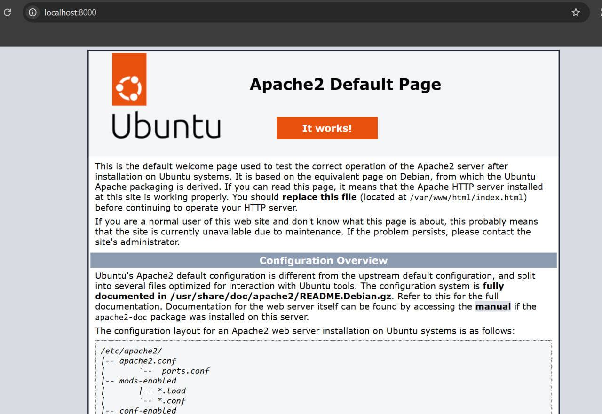
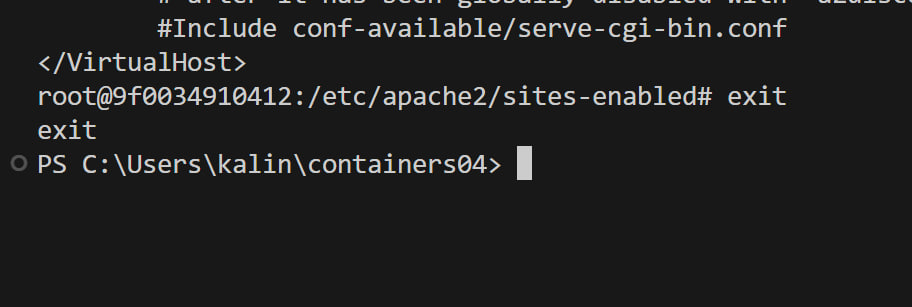

# Лабораторная работа №4. Использование контейнеров как среды выполнения
 
 - **Калинкова София, I2302** 
 - **07.03.2025** 

## Цель работы

Данная лабораторная работа призвана напомнить основные команды ОС Debian/Ubuntu. Также она позволит познакомиться с Docker и его основными командами.

## Задание

Запустить контейнер Ubuntu, установить Web-сервер Apache и вывести в браузере страницу с текстом "Hello, World!".

## Описание выполнения работы с ответами на вопросы

### Подготовка

Для выполнения данной работы необходимо иметь установленный на компьютере Docker.

### Выполнение

1. Создаю репозиторий `containers04` и склонирую его себе на компьютер.

2. Создаю в папке `containers04` файл README.md который содержать пошаговое выполнение проекта. 

### Запуск и тестирование

1. Открываю терминал в папке `containers04` и выполняю команду:

`docker run -ti -p 8000:80 --name containers04 ubuntu bash`

*Эта команда инициализирует контейнер Ubuntu с именем containers04, открывает bash и связывает порты 8000 и 80.*


2. В открывшемся окне выполняю следующие команды и объясняю их назначение:

```
apt update
apt install apache2 -y
service apache2 start
```


*`apt update` Обновляет список доступных пакетов и их версий на системе.*


*`apt install apache2 -y` Устанавливает веб-сервер Apache2 без запроса подтверждения.*


*`service apache2 start` Запускает службу Apache2 для начала работы веб-сервера.*


3. Открываю браузер и ввожу в адресной строке http://localhost:8000. 



4. Выполняю следующие команды:
5. 
*`ls -l /var/www/html/` Показывает список файлов в каталоге /var/www/html/ с подробной информацией (права доступа, владельцы, размер и дата модификации).*

*`echo '<h1>Hello, World!</h1>' > /var/www/html/index.html` Создаёт файл index.html в данном каталоге с содержимым Hello, World!.*


5. Обновляю страницу в браузере:


6. Выполняю следующие команды:

*`cd /etc/apache2/sites-enabled/` Переходит в каталог /etc/apache2/sites-enabled/, где хранятся активированные конфигурации сайтов для Apache2.*

*`cat 000-default.conf` Показывает содержимое конфигурационного файла 000-default.conf, который используется для настройки стандартного виртуального хоста Apache2.*


7. Закрываю окно терминала командой `exit`


8. Смотрю список контейнеров:

`docker ps -a`


9. Удаляю контейнер:

`docker rm containers04`


## Выводы

В ходе лабораторной работы был создан образ на базе ubuntu:latest с установленным веб-сервером Apache, после чего контейнер был успешно запущен, и веб-страница отобразилась корректно по адресу http://localhost:8000. В процессе работы были освоены ключевые команды Docker, такие как создание образов, запуск и удаление контейнеров, а также работа с файловой системой контейнера, что стало хорошей основой для дальнейшего изучения контейнеризации и применения Docker в практических проектах.

## Используемые источники

- Docker Documentation  https://docs.docker.com/get-started/

- Official Apache Documentation (https://httpd.apache.org/docs/)
- Docker — The Basics of Containerization(https://opensource.com/resources/what-docker)
- Linux Basics for Docker(https://linuxize.com/post/how-to-use-docker-on-linux/)
